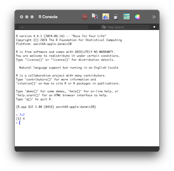
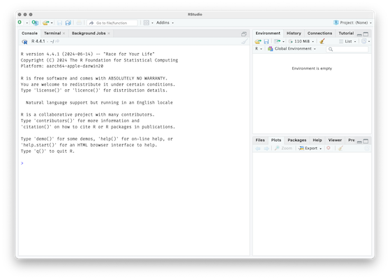
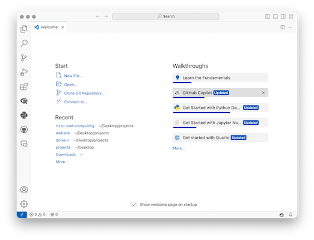
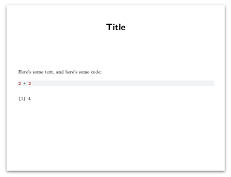

+++
title = "Getting Set Up"
weight = 1
chapter = false
+++


**Please do the following _before_ our first workshop session on Monday Sept 23 at 10:00am**


### 1. Get R

Download (or update to) the latest version of R (version 4.4.1) from https://cran.r-project.org/

R is a software environment for computing, data analysis, and graphics. It's like Python, but geared toward statistical work; like Stata, but better for programming; like Julia but people actually use it; like Matlab, but free.

You are welcome to open the minimal R app once downloaded. It's extremely basic: a single-paned window with a ">" prompt. You type R commands at that prompt (e.g., 2+2 and hit enter). Using R this way works just fine, but it's rather unfriendly. 



## 2. Get an IDE

To improve your experience with R, you'll want an integrated development environment (IDE),  which is an application to help you write, test, and debug code. 

I highly recommend RStudio, particularly if you are new to statistical programming. However, VS Code is another excellent choice, and the folks at RStudio recently released Positron, a fork of VS Code with elements that make it particularly R-friendly. 

- Download the free desktop version of RStudio from  
  https://posit.co/download/rstudio-desktop/

- Alternatively, download VS Code from  
  https://code.visualstudio.com/download

- Or download Positron by following the "Install Postron" section of the ReadMe at  
  https://github.com/posit-dev/positron




RStudio and Positron are ready-to-go right away. Open your IDE and look for the _Console_ (left side of RStudio, bottom of Positron) with a welcome message about R. At the prompt (">") type `x = 2+2` and press return. You should see the object "x" appear in the Global Environment (top-right in RStudio, top-left in Positron). This is good. It means everything is working.

With VS Code, install the R Extension. Then open a new R script file (or a plain text document and save it with the .R extension, eg, filename "test.R").  Type an R command such as `2+2` and hit Cmd+Enter (Mac) or Ctrl+Enter (Windows). This will copy and execute the command in a Terminal pane running R at the bottom of the screen named "R Interactive".  In that R Interactive Terminal, type `x = 2+2` and hit enter.  Click on the R logo in the Activity Bar (default position is the left-side) to display the Workspace, under which you can see the Global Environment.


## 3. Get LaTeX

LaTeX is a markup language that enables us, among other things, to write fancy math and render things into PDF documents. You can download a minimal (but sufficient) amount of LaTeX by running the following two commands at the RStudio command prompt (">"): 

```
install.packages('tinytex')
tinytex::install_tinytex()
```

If you want the full-blown (2GB) LaTeX installation, go to https://www.Latex-project.org/get/ and scroll down to the links for the MacTex Distribution (for Mac users) and MikTex Distribution (for Windows users). 


## 4. Compile a Quarto document to PDF

Create an empty text file.  Copy the code below and save the file as a .qmd file (eg, filename "test.qmd").  

````
---
title: "Title"
format: pdf
---

Here's some text, and here's some code:

```{r}
2 + 2
```
````

Render the file, agreeing to install the "knitr" package if prompted.  

- RStudio:  Click the button with the blue arrow in the top center of the screen labeled "Render"
- Positron:  Click the button on the top-right of the file labeled "Preview"
- VS Code:  Install the Quarto extension. Then, like with Positron, click the button labeled "Preview"

This does the following: 

1. The knitr package in R executes the code and converts quarto (test.qmd) to markdown (test.md)
2. Pandoc (a program bundled with RStudio and Position, and is installed with the Quarto extension in VS Code) converts the markdown file into a LaTeX file (test.tex) 
3. Your LaTeX engine (installed via TinyTex in step 3 above) renders the .tex file to a PDF file (test.pdf)
4. Your PDF, once rendered, should automatically open for you to view in either a pane of your IDE or in a separate window with your system's default PDF viewing application



If you created the source .qmd document with R code and got it render to PDF, as below, then you're all set!

If not, your IDE should report an error. Copy/paste the error into a web search or a LLM and troubleshoot. If that fails, we can fix it together.


## One more thing

I strongly recommend you pick up **any book on R** and just start reading. Recommendations can be found [here](/9-resources).
