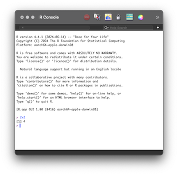
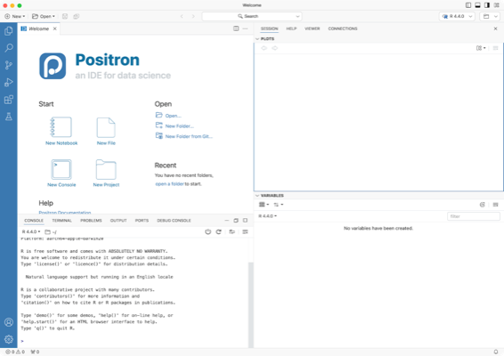
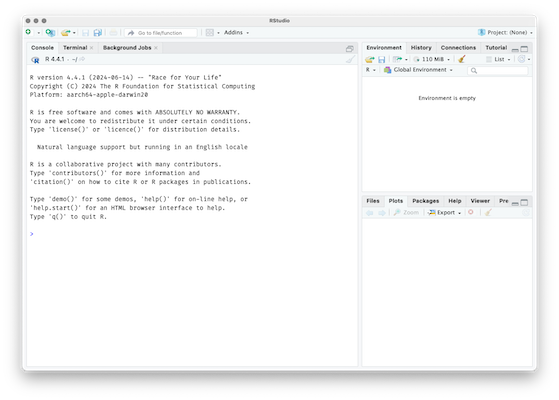
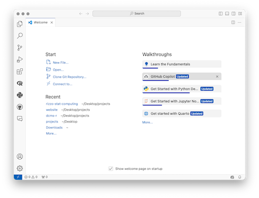
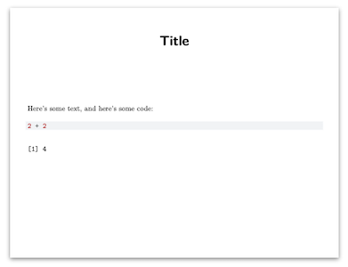

+++
title = "Getting Set Up"
weight = 1
chapter = false
+++


**Please do the following _before_ our first workshop session on Monday Sept 21 at 10:00am**


### 1. Get R

Download (or update to) the latest version of R (version 4.6.1) from https://cran.r-project.org/ 

R is a software environment for computing, data analysis, and graphics. It's like Python, but geared toward statistical work; like Stata, but better for programming; like Julia but lots people use it; like Matlab, but free.

You are welcome to open the minimal R app once downloaded. It's extremely basic: a single-paned window with a ">" prompt. You type R commands at that prompt (e.g., 2+2 and hit enter). Using R this way (or at the command line in a terminal) works just fine, but it's rather unfriendly. 



## 2. Get an IDE

To improve your experience with R, you'll want an integrated development environment (IDE),  which is an application to help you write, test, and debug code. 

I highly recommend Positron (a fork of VS Code), but RStudio and VS Code are other excellent choices. 

- Download Positron or RStudio by clicking their download buttons at the top-right of 
  https://posit.co/ 

- Or, download VS Code from  
  https://code.visualstudio.com/download





RStudio and Positron are ready-to-go right away. Open your IDE and look for the _Console_ (left side of RStudio, bottom-middle of Positron) with a welcome message about R. (In Positron, if you don't see the message, but you see the option to "Start Session" click that and select R from the popup at the top of the screen.) 

At the prompt (">") in the console, type `x = 2+2` and press return. You should see the object "x" appear in the top-right pane (called the "Global Environment" in RStudio or the "Session Variables" in Positron). This is good. It means everything is working.

With VS Code, install the R Extension from the Extensions tab in the Activity Bar (default position is the left-most pane). Then bring up the Command Palette with Cmd+Shift+P (Mac) or Ctrl+Shift+P (Windows) and run "R: Create R terminal". A new console should appear at the bottom of the screen. At the prompt (">") in the console, type `x = 2+2` and press return. Click on the R logo in the Activity Bar (left-side) to display the R Workspace, under which you can see the Global Environment containing "x".


## 3. Get LaTeX

LaTeX is a markup language that enables us, among other things, to write fancy math and render things into PDF documents. You can download a minimal (but sufficient) amount of LaTeX by running the following two commands at the R prompt (">"): 

```
install.packages('tinytex')
tinytex::install_tinytex()
```

If you want the full-blown (2GB) LaTeX installation, go to https://www.Latex-project.org/get/ and scroll down to the links for the MacTex Distribution (for Mac users) and MikTex Distribution (for Windows users). 


## 4. Compile a Quarto document to PDF

Create an empty text file.  Copy the code below and save the file as a .qmd file (eg, filename "test.qmd").  

````
---
title: "Title"
format: pdf
---

Here's some text; some code follows:

```{r}
2 + 2
```
````

Render the file, agreeing to install the "knitr" or "rmarkdown" packages, if prompted.  

- RStudio:  Click the button with the blue arrow in the top center of the screen labeled "Render"
- Positron:  Click the button on the top-left of the file labeled "Preview"
- VS Code:  Install the Quarto extension, then click the "Preview" on the top-right of the document (next to the split-editor button)
- Or, use Cmd+Shift+K (Mac) or Ctrl+Shift+K (Windows)

This does the following: 

1. The knitr package in R executes any R code and converts the source quarto file (test.qmd) to an intermediate markdown file (test.md)
2. Pandoc (a program bundled with RStudio and Position, and is installed with the Quarto extension in VS Code) converts the markdown file into a LaTeX file (test.tex) 
3. Your LaTeX engine (installed via TinyTex in step 3 above) renders the .tex file to a PDF file (test.pdf)
4. Your PDF, once rendered, should automatically open for you to view in either a pane of your IDE or in a separate window with your system's default PDF viewing application. The PDF file is on disk in the same directory where you saved test.qmd.



If you created the source Quarto document and got it render to PDF, as below, then you're all set!

If not, your IDE should report an error. Copy/paste the error into a web search or a LLM and troubleshoot. If that fails, we can fix it together.


## One more thing

I strongly recommend you pick up **any book on R** and just start reading. Recommendations can be found [here](/9-resources).
